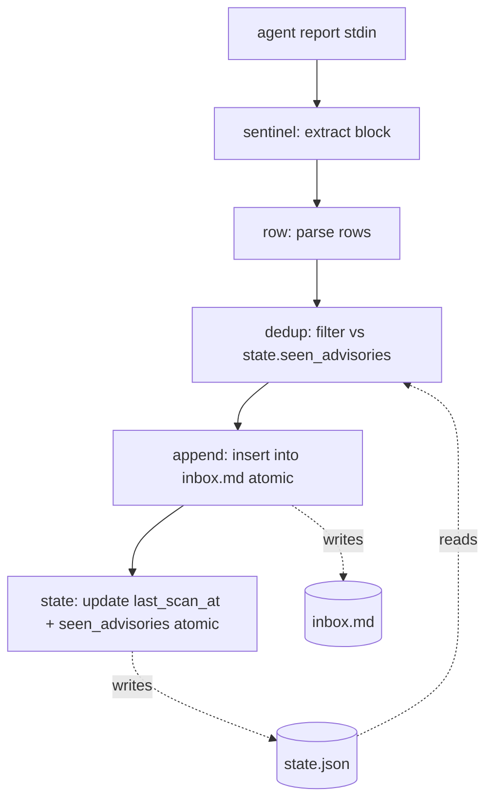

# PHIẾU P012: README + ARCHITECTURE polish + `cargo publish --dry-run` clean

> **ID format:** `P012` — counter `.phieu-counter` = 12 sau P011 ship.
> **Filename:** `docs/ticket/P012-polish-publish.md`
> **Branch:** `chore/P012-polish-publish`

---

> **Loại:** chore (release prep — docs polish only, NO code change)
> **Tầng:** 2
> **Ưu tiên:** P1 (Phase 4 opener — gates P013 tarot install; without crates.io metadata clean + README coherent, P013 cannot `cargo install advisory-inbox`)
> **Ảnh hưởng:** `README.md` (rewrite into coherent flow, trim to < 200 lines), `docs/ARCHITECTURE.md` §5 (consolidate "Scaffold status" P001-P011 list into 1-line "All Phase 1-3 modules shipped" + add high-level flow diagram), `docs/CHANGELOG.md` (P012 entry — pre-1.0 release prep), POTENTIAL `Cargo.toml` (Worker Tầng 2 self-decide — add `documentation = "..."` field if missing; current state already complete per Anchor #2 — Worker skip if not needed). NO `src/` change. NO test change.
> **Dependency:** P001-P011 (all 11 phiếu shipped — README polish consolidates their per-phiếu Quick Start sections; ARCHITECTURE §5 "Scaffold status" list is the artifact being consolidated). KHÔNG dependency on P013 (P013 will `cargo install advisory-inbox` after this phiếu validates publish metadata).
> **Lane:** **Normal** (docs polish per RULES.md §1 — explicit "README updates không touch invariants/security" + "Non-architecture cleanup" — but NOT Fast lane because Worker also runs `cargo publish --dry-run` which exercises full packaging pipeline + might surface metadata fix. Normal flow = Architect short → Worker challenge Turn 1 → Execute.)
> **Sub-mech áp dụng:** **B** (capability — `cargo publish --dry-run` exits 0; `cargo build --release` clean; existing 69 tests pass per P011 baseline). **D** (persistence — README + ARCHITECTURE are durable docs per RULES.md §6; CHANGELOG entry documents release prep). **E** (environment drift — `cargo publish --dry-run` exercises clean-package build; verifies no `path = "..."` deps + LICENSE bundled). **A N/A** (no new trigger structure shipped). **C N/A** (no state schema change). **F** (token leak grep on Cargo.toml + README + ARCHITECTURE diffs).

---

## Context

### Vấn đề hiện tại

Phase 1-3 đã ship (P001-P011, 11 PRs merged, 69 tests, binary ~2.16 MB). Phase 4 mở với P012 — release polish trước khi P013 install vào tarot.

**Symptoms cần fix:**

1. **README.md fragmented (244 lines).** Per-phiếu Quick Start sections (P004-P011) đã accrete vào README sequentially. Result: 8 subcommand sections với inconsistent depth (`parse-report` + `dedup` có exit-code table + behavior paragraphs; `append` có behavior + atomic note; `migrate-state` + `state-backfill` + `scan-and-append` có flag tables + behavior paragraphs; MCP section bottom-of-file). Acceptance: < 200 lines, coherent flow.

2. **ARCHITECTURE.md §5 "Scaffold status" list bloated.** Lines 245-257 enumerate every P001-P011 ship entry (~12 multi-line entries). Useful WHILE Phase 1-3 in progress; now stale noise because all 11 shipped. Consolidate to 1-line "All Phase 1-3 modules shipped (P001-P011); see CHANGELOG for ship details" + optional high-level flow diagram.

3. **`cargo publish --dry-run` not exercised.** Cargo.toml metadata appears complete (Anchor #2 verified all required fields) but `cargo publish --dry-run` actually packages + builds from clean source dir + verifies no `path = ".."` deps + bundles LICENSE + README. Until run, packaging health unknown.

Reference BACKLOG.md P012 (line 109-114):
- Lane: Normal (docs polish, không touch code per RULES.md §1).
- Scope: README with quick-start. ARCHITECTURE diagram. `cargo publish --dry-run` clean.
- Acceptance: README < 200 lines, ARCHITECTURE complete.

### Giải pháp

**5 tasks, all polish — no code change, no test change, no schema change.**

#### Decision #1 — README.md target structure (< 200 lines)

Worker rewrites `README.md` into coherent flow. Suggested structure (Worker Tầng 2 self-decide exact heading levels + code block syntax):

```
# advisory-inbox

[1-paragraph header: "what this is" — CLI + MCP dual mode, replaces 142-line Bash heredoc, advisory inbox state machine]

## Install

cargo install advisory-inbox

## CLI subcommands

### parse-report
[1-2 sentence purpose + 1 example + 1-line exit-code summary OR link to ARCHITECTURE §1]

### dedup
[same shape — 1 example, brief]

### append
[same shape]

### migrate-state
[same shape]

### state-backfill
[same shape]

### scan-and-append
[same shape — composite, 1 example, brief]

### init
[same shape — config templates]

### serve
[same shape — MCP server mode, 1 example]

## MCP server mode

[1 paragraph: what MCP is, who calls it (Claude Code via .mcp.json).
 1 example `.mcp.json` config (4-5 lines).
 1 example `tools/call` JSON-RPC payload (4-6 lines).
 Link to docs/ARCHITECTURE.md §6 for full tool list + schemas.]

## Architecture

See [docs/ARCHITECTURE.md](docs/ARCHITECTURE.md).

## Development

[3-line block: cargo build / cargo test / cargo clippy]

## License

MIT — see LICENSE.
```

**Trimming guidance for Worker:**

- Current README §parse-report (lines 15-34) keeps full exit-code table — TRIM to 1 example + 1-line "see ARCHITECTURE.md §1 for exit codes".
- Per-subcmd exit-code tables (currently 4-5 lines each × 6 subcmds = ~30 lines) → consolidate into single `## Exit codes` short section OR delegate fully to ARCHITECTURE §1.
- "Atomic write" callouts (currently repeated in `append` / `migrate-state` / `state-backfill` / `scan-and-append`) → 1-line note under §scan-and-append: "All state/inbox writes use temp+fsync+rename per INV-LOCAL-002 (atomic, crash-safe)" — no need to repeat per-subcmd.
- Long "Behaviors" + "Flags" + "Output" lists per subcmd → collapse to 1 example invocation + 1-line output preview. Detail belongs in `--help` output + ARCHITECTURE.md.
- MCP section keep example JSON-RPC payload (Tools available table can shrink to 6 names + link to ARCHITECTURE §6 for full schemas).

**Hard target:** ≤ 200 lines (`wc -l README.md` ≤ 200). Acceptance.

**KHÔNG remove:** `cargo install advisory-inbox` (Install section), MIT license note, link to ARCHITECTURE.md, MCP `.mcp.json` example (P013 needs this).

**KHÔNG change CLI surface or any subcmd semantics in the README** — pure description trim. Worker MUST NOT invent a flag or rename a subcmd while polishing.

#### Decision #2 — ARCHITECTURE.md §5 Module Layout cleanup

Current §5 (lines 219-257) has:
- Module tree (lines 221-243) — KEEP. Accurate post-P011.
- Note paragraph (line 243) — KEEP.
- "**Scaffold status (2026-05-28):**" list (lines 245-257) — CONSOLIDATE.

Replacement for lines 245-257:

```
**Scaffold status (Phase 1-3 complete, 2026-05-28):** All modules shipped via P001-P011 (see `docs/CHANGELOG.md` for per-phiếu ship details; `docs/DISCOVERIES.md` index for findings). 69 tests pass. Binary size ~2.16 MB release.

**Pending phiếu (see BACKLOG.md):** P012 (release polish — this phiếu), P013 (tarot install — replaces 142-line Bash heredoc).
```

**Flow diagram (NEW addition to §5 — Worker Tầng 2 self-decide ASCII vs Mermaid):**

ASCII option (renders identically on GitHub + plaintext):
```
                 agent report (stdin)
                       │
                       ▼
                 ┌───────────┐
                 │ sentinel  │  extract <!-- INBOX_APPEND_START/END --> block
                 └─────┬─────┘
                       ▼
                 ┌───────────┐
                 │   row     │  parse pipe-delimited rows → AdvisoryRow[]
                 └─────┬─────┘
                       ▼
                 ┌───────────┐                 ┌──────────────────────┐
                 │  dedup    │ ◄── reads ──── │ state.json           │
                 │           │                 │ seen_advisories[]    │
                 └─────┬─────┘                 └──────────────────────┘
                       ▼
                 ┌───────────┐                 ┌──────────────────────┐
                 │  append   │ ── writes ───► │ inbox.md (atomic)    │
                 │           │                 │ ## Rows + table      │
                 └─────┬─────┘                 └──────────────────────┘
                       ▼
                 ┌───────────┐                 ┌──────────────────────┐
                 │   state   │ ── writes ───► │ state.json (atomic)  │
                 │  update   │                 │ + last_scan_at       │
                 └───────────┘                 └──────────────────────┘
```

Mermaid option (renders on GitHub; plaintext readers see source):


Either is acceptable. Worker picks whichever they think renders cleanest in the repo's typical viewing context (GitHub web vs `less` in terminal). ASCII more universal; Mermaid more compact + renders pretty on GitHub.

**Insert flow diagram immediately AFTER the module tree (line 241) and BEFORE the Note paragraph (line 243), OR at the very top of §5 before the module tree** — Worker Tầng 2 self-decide for readability. Recommendation: top of §5 (flow first → then "here's where each step lives" tree).

#### Decision #3 — Verify ARCHITECTURE.md §1-§10 current

Worker reads ARCHITECTURE.md §1-§10 sections and checks for stale "planned" / "TBD" / "P0XX (planned)" wording. P010 + P011 both shipped; any "(planned)" reference for those phiếu numbers is stale.

Known checkpoints (Worker verify each — Tầng 2 mechanical fix if found):
- §6 "Status" subsection (lines 263-266 per Anchor #4) — P010 + P011 both already say "shipped". ✅ Likely OK.
- §5 module tree comments — `# pub fn execute(...) helper for MCP reuse (P011)` and `# AdvisoryInboxService + 6 #[tool] methods` are already past-tense (per P011 ship). ✅ Likely OK.
- Any other section mentioning "Phase 4" or "P012" as future — leave (this phiếu IS P012; once shipped, future phiếu polish can flip).

If Worker finds a stale "planned" reference, FIX it in this phiếu (Tầng 2 mechanical). Discovery Report logs the find.

#### Decision #4 — `cargo publish --dry-run --allow-dirty` MUST exit 0

Worker runs:
```bash
cargo publish --dry-run --allow-dirty
```

`--allow-dirty` because the phiếu file (`docs/ticket/P012-polish-publish.md`) + README + ARCHITECTURE diffs are uncommitted at run-time. Equivalent to `cargo package --allow-dirty` then build the .crate file.

**What `--dry-run` exercises:**
- `[package]` metadata complete (name, version, description, license, repository, keywords ≤ 5, categories, readme — all verified at Anchor #2).
- LICENSE file present at repo root and discoverable (Anchor #3 confirmed).
- README.md exists (path matches `readme = "README.md"`).
- No `path = "..."` dependencies in `[dependencies]` (Anchor #2 confirmed — all 11 deps are crates.io versions).
- No path-only dev-dependencies that block publishing (`assert_cmd` + `predicates` + `tokio-test` are all crates.io versions per Anchor #2).
- Package builds clean from packaged source (excludes `.git/`, `target/`, `.backup/`).
- Documentation builds OK (`cargo doc` implicit — does not fail).

**Common failures + Worker fixes (Tầng 2 mechanical):**

| Failure | Likely cause | Fix |
|---------|--------------|-----|
| `manifest has no description` | Cargo.toml missing field | Already populated per Anchor #2 — not expected to hit. |
| `the license field is not set` | Missing | Already `license = "MIT"` per Anchor #2. |
| `failed to verify package tarball` | LICENSE not bundled | Verify `LICENSE` at repo root (Anchor #3 confirmed). If `.gitignore` accidentally hides it → fix `.gitignore` (Hard Stop — escalate as design objection if scope creeps beyond a single `.gitignore` line). |
| `keywords too many (max 5)` | > 5 keywords | Already 5 per Anchor #2 (`security`, `advisory`, `cve`, `inbox`, `claude-code`). Not expected. |
| `categories invalid: <X>` | Non-canonical category name | Already `command-line-utilities` + `development-tools` (both canonical) per Anchor #2. Not expected. |
| `error: invalid character in path "src/<file>"` | Cargo packaging tripped on something | Investigate; document in Discovery Report. |

**If `cargo publish --dry-run` surfaces a problem not in the above table, OR requires more than a 1-line Cargo.toml fix → STOP, escalate as design objection** (means metadata assumption from Anchor #2 was incomplete; Architect needs to re-spec).

**KHÔNG actually publish.** `--dry-run` only. Real `cargo publish` is a separate decision Sếp makes post-P012 ship (probably post-P013 tarot install validates end-to-end).

#### Decision #5 — `Cargo.toml` optional polish (Worker Tầng 2 self-decide)

Current Cargo.toml `[package]` has all REQUIRED publish fields populated. Optional fields Worker may add (Tầng 2 self-decide; recommended NOT to add unless `cargo publish --dry-run` requests them):

- `documentation = "https://docs.rs/advisory-inbox"` — docs.rs auto-builds when published; this field tells crates.io where to link "Documentation" button. Skip is fine — crates.io defaults to docs.rs when published.
- `rust-version = "1.85"` — MSRV declaration (PROJECT.md line 56 says "MSRV target: Rust 1.85"). Optional but good hygiene. Worker MAY add (1-line change).
- `exclude = ["docs/", "phieu/", ".sos-state/", ".backup/", "scripts/", "tests/fixtures/agent-report-1.md"]` — reduce .crate file size. Optional. Worker MAY add IF `cargo publish --dry-run` warning suggests it OR `.crate` tarball is unexpectedly large (> 1 MB).

**Default recommendation:** add `rust-version = "1.85"` (1-line, gates MSRV-incompatible installs); skip `documentation` and `exclude` unless `--dry-run` complains. Tầng 2 — Worker decides.

#### Decision #6 — CHANGELOG entry shape

Append at top of `docs/CHANGELOG.md` (newest-first convention):

```markdown
## [P012] — Release polish (README + ARCHITECTURE + cargo publish --dry-run)

**Date:** 2026-05-28
**Phase:** 4 (Ship) — opener
**Lane:** Normal
**Tầng:** 2 (docs polish, NO code change)

### Changed
- `README.md` consolidated from 244 lines (per-phiếu accreted Quick Start sections) to < 200 lines.
  - Unified subcmd sections (1 example + brief note each); exit-code detail delegated to ARCHITECTURE §1.
  - MCP section trimmed to essential `.mcp.json` config + 1 `tools/call` example.
  - "Atomic write" callouts consolidated to single INV-LOCAL-002 note.
- `docs/ARCHITECTURE.md` §5 "Scaffold status" list (12 multi-line P001-P011 entries) consolidated to 1-line "All Phase 1-3 modules shipped" + pointer to CHANGELOG/DISCOVERIES.
- `docs/ARCHITECTURE.md` §5 gains flow diagram (agent report → sentinel → row → dedup → append → state) as visual map.

### Verified
- `cargo publish --dry-run --allow-dirty` exits 0 — package builds clean from clean source; all metadata fields valid; no `path = "..."` deps; LICENSE + README bundled.
- `cargo build --release` zero warnings.
- `cargo test --all` 69 tests pass (P011 baseline preserved — no test change in P012).
- `cargo clippy --all-targets -- -D warnings` clean.
- `cargo fmt --check` no diff.

### Not changed
- NO code change in `src/`. NO test change in `tests/` or `src/**/tests`. NO state schema, inbox format, sentinel marker, CLI subcmd shape, or MCP tool surface change.
- Cargo.toml may gain `rust-version = "1.85"` (Worker Tầng 2 self-decide; MSRV hygiene). No other dep / feature / version change.

### Phase 4 next
- P013: install advisory-inbox into tarot (replace 142-line Bash heredoc).
```

Worker MAY adjust prose; the section structure (Changed / Verified / Not changed / Phase 4 next) matches prior CHANGELOG entries (Worker verify shape against existing entries — Anchor #5).

### Scope

- CHỈ sửa: `README.md` (rewrite + trim to < 200 lines), `docs/ARCHITECTURE.md` (§5 consolidate scaffold-status list + add flow diagram; verify §1-§10 for stale "planned" refs), `docs/CHANGELOG.md` (P012 entry — top of file).
- POTENTIAL sửa: `Cargo.toml` (Worker Tầng 2 — add `rust-version = "1.85"` recommended; `documentation` + `exclude` only if `cargo publish --dry-run` requires).
- KHÔNG sửa: `src/**` (NO code change — this is polish-only). `tests/**` (NO test change — 69 tests must still pass unchanged). `docs/PROJECT.md` (Phase 4 already declared in §Roadmap). `docs/BACKLOG.md` (P012 entry already accurate — strikethrough done at PR merge per `docs/RULES.md` §6 Project debt rotation). `docs/RULES.md`. `docs/security/INVARIANTS.md`. `.mcp.json`. `.claude/agents/**`. `phieu/TICKET_TEMPLATE.md`. `LICENSE`. `.gitignore` (unless `--dry-run` surfaces a bundling issue — Hard Stop scope creep otherwise).
- KHÔNG tạo: any new `src/` module, `tests/` file, or `docs/` file (beyond the Discovery Report `docs/discoveries/P012.md` which is mandatory).
- KHÔNG run `cargo publish` (real). `--dry-run` only.
- KHÔNG change rmcp version / feature set / any dep version. (Pure polish — depend bump is a separate phiếu.)
- KHÔNG add new dep. (CLAUDE.md Hard Stop #2 — no exception in P012's scope.)
- KHÔNG change CLI subcmd shape / flag / exit code semantics. (Pure docs polish.)
- KHÔNG modify state file format / inbox markdown format / sentinel markers. (Pure docs polish.)

### Skills consulted

**Architect did NOT invoke context7 or other research tools for P012.** Reasoning: P012 is polish-only — no library API surface to verify. README + ARCHITECTURE + CHANGELOG content is local knowledge sourced from:
- BACKLOG.md P012 entry (lines 109-114).
- PROJECT.md §Roadmap Phase 4 (lines 90-92).
- CHANGELOG.md existing entries shape (Worker reads to match convention — Anchor #5).
- README.md current state (Architect Read pre-phiếu — Anchor #1: 244 lines).
- ARCHITECTURE.md current §5 list (Architect Read pre-phiếu — Anchor #4: 12 P001-P011 entries lines 245-257).
- Cargo.toml current metadata (Architect Read pre-phiếu — Anchor #2: all required publish fields populated).
- `cargo publish --dry-run` behavior is standard Cargo (no rmcp / schemars / clap API to verify).

**Architect DID Read pre-phiếu** (local files only — within envelope):
- `docs/BACKLOG.md` (P012 brief + Phase 4 context).
- `docs/PROJECT.md` (Phase 4 declaration + Tech Stack table for README "what this is" paragraph).
- `docs/DISCOVERIES.md` (last 11 entries — P001-P011 ship summaries, used in CHANGELOG entry "Verified" block).
- `phieu/TICKET_TEMPLATE.md` (this phiếu format).
- `Cargo.toml` (verify publish metadata complete — Anchor #2).
- `README.md` (verify current line count + structure — Anchor #1).
- `docs/ARCHITECTURE.md` first 80 lines + lines 200-300 (§4 + §5 + §6 — verify scaffold-status list shape + MCP status — Anchors #4, #6, #7).
- `docs/ticket/P011-mcp-tools.md` (prior phiếu format reference + verify ARCHITECTURE §6 P011 already says "shipped").

Architect did NOT Read `src/**`, `tests/**`, or any file under `target/` per envelope constraints. All code-level claims in this phiếu are docs-sourced + carry `[verified]` / `[needs Worker verify]` markers per RULES.md §humility.

---

## Verification Anchors — Kiến trúc sư đã verify lúc viết phiếu

> Mỗi anchor PHẢI carry humility marker `[verified]` / `[unverified]` / `[needs Worker verify]`.

| # | Assumption | Verify bằng cách nào | Marker | Kết quả |
|---|-----------|---------------------|--------|---------|
| 1 | `README.md` is currently **244 lines** (over 200-line acceptance target). Per-subcmd sections accreted from P004-P011. | Architect Read `README.md` end-of-file line was 244. | `[verified]` | ✅ 244 lines. Trim target: remove ≥ 45 lines. |
| 2 | `Cargo.toml` has ALL required `cargo publish` metadata: `name`, `version`, `edition`, `description`, `license = "MIT"`, `repository`, `homepage`, `keywords` (5 items, ≤ 5 cap), `categories` (2 canonical: `command-line-utilities`, `development-tools`), `readme = "README.md"`. NO `documentation` field. NO `rust-version` field. NO `exclude` field. ALL deps are crates.io versions (no `path = "..."` or `git = "..."`). | Architect Read `Cargo.toml` lines 1-30. | `[verified]` | ✅ All required publish fields present. Optional fields (`documentation`, `rust-version`, `exclude`) absent — Worker Tầng 2 add `rust-version = "1.85"` recommended (Decision #5). |
| 3 | `LICENSE` file exists at repo root (not just in `target/doc/static.files/` — those are rustdoc artifacts). Required for `cargo publish` to bundle license proof. | Architect ran `Glob("LICENSE*")` — first match at repo root, additional matches under `target/doc/` (rustdoc, irrelevant). | `[verified]` | ✅ `LICENSE` present at repo root. |
| 4 | `docs/ARCHITECTURE.md` §5 "Scaffold status (2026-05-28):" list spans lines 245-257 (~12 multi-line bullets for P001-P011). The module tree (lines 221-243) is current. §5 has NO flow diagram. | Architect Read ARCHITECTURE.md lines 200-300. | `[verified]` | ✅ Lines 245-257 confirmed; tree current; no flow diagram present. |
| 5 | `docs/CHANGELOG.md` uses newest-first ordering with `## [P<NNN>] — <title>` headings + sections (Changed/Verified/Not changed/etc.). Worker matches this shape for the P012 entry. | Architect did NOT Read CHANGELOG.md directly in this Bước 0 (envelope allows Read but Architect economized — CHANGELOG shape is convention, Worker reads at EXECUTE to match). | `[needs Worker verify]` | ⏳ TO VERIFY at EXECUTE (`head -50 docs/CHANGELOG.md`). If shape differs from Architect's guess (Decision #6), Worker adapts the P012 entry to match repo convention. Mechanical — no shape objection needed unless Architect's guess is wildly off. |
| 6 | `docs/ARCHITECTURE.md` §6 "Status" subsection already marks BOTH P010 and P011 as "shipped 2026-05-28". No "(planned)" wording for those phiếu numbers in §6. | Architect Read ARCHITECTURE.md §6 lines 263-266. | `[verified]` | ✅ Lines 265 + 266 both say "(shipped 2026-05-28)". No stale "planned" reference. |
| 7 | `docs/ARCHITECTURE.md` §5 module tree (lines 221-243) comments are accurate post-P011 (`# pub fn execute(...) helper for MCP reuse (P011)`, `# AdvisoryInboxService + 6 #[tool] methods`, `# AdvisoryRow struct + (de)serialize + JsonSchema (P011)`). | Architect Read ARCHITECTURE.md lines 219-243. | `[verified]` | ✅ Tree comments current. |
| 8 | Existing 69 tests baseline from P011. P012 makes NO test change. `cargo test --all` post-P012 returns 69 passing tests (same count). | DISCOVERIES.md P011 entry confirms "69 tests total". | `[verified]` | ✅ 69 tests baseline. P012 acceptance: same 69 still pass. |
| 9 | `cargo publish --dry-run` flag exists in Cargo 1.85+ and is the canonical way to validate package metadata without publishing. `--allow-dirty` flag allows uncommitted working tree. | Architect's standard Cargo knowledge. | `[unverified]` | ⏳ TO VERIFY at EXECUTE — if Worker's Cargo version doesn't support `--dry-run` (very unlikely; flag has been stable since Cargo 0.16+), escalate. Recovery: use `cargo package --allow-dirty` instead (older equivalent). |
| 10 | No `path = "..."` dependencies in Cargo.toml that would block publishing. (Crates with path-deps cannot publish.) | Architect Read Cargo.toml `[dependencies]` block (lines 13-24) and `[dev-dependencies]` (lines 26-29). All entries use version strings (e.g., `"4"`, `"1.7.0"`, `{ version = "1", features = [...] }`). No `path =` keys. | `[verified]` | ✅ All deps are crates.io versions. |
| 11 | `.gitignore` does NOT ignore `LICENSE` or `README.md` (which would break Cargo bundling). | Architect did NOT Read `.gitignore`. | `[needs Worker verify]` | ⏳ TO VERIFY at EXECUTE (`grep -E '^LICENSE\|^README' .gitignore`). Expected: 0 hits. If `.gitignore` accidentally hides either → fix `.gitignore` (1-line) within phiếu scope. |
| 12 | `tests/fixtures/` directory (if present) does NOT need to be excluded from package — `cargo publish` includes only `src/` + `Cargo.toml` + `README.md` + `LICENSE` by default; tests are local. But if `tests/` is unexpectedly large and bumps `.crate` size > 10 MB, Worker may add `exclude = ["tests/fixtures/"]` (Tầng 2 Decision #5 optional). | Architect knows `tests/scan_and_append_cli.rs` + `tests/serve_cli.rs` + `tests/mcp_tools_cli.rs` exist (P009/P010/P011 ship records); `tests/fixtures/agent-report-1.md` referenced in BACKLOG P004. | `[unverified]` | ⏳ TO VERIFY at EXECUTE via `cargo publish --dry-run` output ("Packaging X files, Y MB"). If > 5 MB total, Worker considers `exclude` Tầng 2 (not Hard Stop). |
| 13 | `docs/CHANGELOG.md` exists (P001-P011 must have added entries per CLAUDE.md DoD item 6). | Per CLAUDE.md DoD item 6 + DISCOVERIES.md entries reference CHANGELOG updates. | `[unverified]` | ⏳ TO VERIFY at EXECUTE (`ls docs/CHANGELOG.md`). Expected: exists. If missing (would mean prior phiếu DoD violated), Worker creates with P012 entry + escalates Discovery Report flag. |
| 14 | Sub-mech F: token leak grep on README + ARCHITECTURE + CHANGELOG + Cargo.toml diffs must be clean (no `ghp_/gho_/ghu_/ghs_/github_pat_` patterns introduced). Polish docs are pure prose — extremely unlikely to introduce tokens, but Worker still verifies per RULES.md §7 matrix. | Worker grep post-EXECUTE. | `[needs Worker verify]` | ⏳ TO VERIFY at EXECUTE (`grep -E 'ghp_\|gho_\|ghu_\|ghs_\|github_pat_' README.md docs/ARCHITECTURE.md docs/CHANGELOG.md Cargo.toml`). Expected: 0 hits. |
| 15 | Sub-mech B trigger smoke: `cargo publish --dry-run --allow-dirty` exits 0 post-polish. | Worker via `cargo publish --dry-run --allow-dirty; echo "exit=$?"`. | `[needs Worker verify]` | ⏳ TO VERIFY at EXECUTE. Hard Stop if non-zero exit with cause Worker cannot fix in ≤ 3 lines of Cargo.toml diff (escalate as design objection — Architect's metadata assumption incomplete). |
| 16 | Binary size post-P012 unchanged from P011 baseline (~2.16 MB) because NO code change. | DISCOVERIES.md P011 line 13 "binary ~2.16 MB". | `[verified]` | ✅ Baseline confirmed. P012 acceptance: `ls -la target/release/advisory-inbox` ≤ 2.5 MB (allows minor rustc/dep noise; Hard Stop only if > 5 MB unexpectedly). |
| 17 | `docs/discoveries/P012.md` must be written per CLAUDE.md DoD item 9 — even for polish phiếu. Index entry to `docs/DISCOVERIES.md` newest-at-top. | CLAUDE.md DoD item 9 mandatory. | `[needs Worker verify]` | ⏳ TO VERIFY at EXECUTE — Worker writes Discovery Report covering: README trim ratio (244→ X lines), ARCHITECTURE diff summary, `cargo publish --dry-run` output, any Cargo.toml diff (rust-version added or not), any stale "planned" wording found in ARCHITECTURE §1-§10. |
| 18 | `cargo publish --dry-run` does NOT require crates.io credentials (token only needed for real publish). Worker can run without `~/.cargo/credentials.toml` configured. | Standard Cargo behavior. | `[unverified]` | ⏳ TO VERIFY at EXECUTE — if `--dry-run` errors on missing token, that's a bug in our understanding; escalate. (Very unlikely; `--dry-run` is the no-network path.) |
| 19 | README current MCP section (lines 192-243 — Architect Read) has full `.mcp.json` example + `tools/call` JSON-RPC payload + Tools table. P012 keeps this content but compresses (Tools table can shrink to name + brief; full schemas in ARCHITECTURE §6). | Architect Read README lines 192-243. | `[verified]` | ✅ MCP section content known. Worker trims while preserving the `.mcp.json` config + ≥ 1 tools/call example (P013 needs both). |
| 20 | Diagram format (ASCII vs Mermaid) is Tầng 2 self-decide — Worker picks based on repo viewing context. Both render on GitHub; only ASCII renders in `less` terminal. | Architect Decision #2. | `[verified]` | ✅ Decision locked. Worker free to pick. |

**Hard Stop triggers:**
- Anchor #11 — `.gitignore` ignores LICENSE / README → fix in this phiếu (1-line) OR escalate if fix > 3 lines.
- Anchor #15 — `cargo publish --dry-run` non-zero exit with cause NOT fixable in ≤ 3 Cargo.toml lines → STOP, escalate design objection.
- Anchor #16 — binary size jumps unexpectedly > 5 MB despite no code change → STOP, investigate (likely a dep transitive change since P011 ship — out of scope for P012 polish).

**Nếu cột "Kết quả" có ❌ → Kiến trúc sư đã biết assumption sai và ghi rõ trong phiếu cách xử lý.** Hiện không có ❌. All `[needs Worker verify]` / `[unverified]` anchors resolve at EXECUTE; the Tầng 2 self-decide options are documented so Worker can proceed without round-tripping for trivial mechanical adjustments.

### Pre-phiếu snapshot (Worker auto first-step)

```bash
# Run from project root (worktree root for phiếu workflow):
PHIEU_ID="P012"
mkdir -p ".backup/${PHIEU_ID}"
cp README.md ".backup/${PHIEU_ID}/README.md.before" 2>/dev/null || true
cp docs/ARCHITECTURE.md ".backup/${PHIEU_ID}/ARCHITECTURE.md.before" 2>/dev/null || true
cp docs/CHANGELOG.md ".backup/${PHIEU_ID}/CHANGELOG.md.before" 2>/dev/null || true
cp Cargo.toml ".backup/${PHIEU_ID}/Cargo.toml.before" 2>/dev/null || true
git rev-parse HEAD > ".backup/${PHIEU_ID}/main-head.txt"
echo "✓ Snapshot at .backup/${PHIEU_ID}/ — auto-cleaned on phieu-done"
```

If polish goes wrong mid-execute and you need to roll back: restore the `.before` copies + `git reset --hard $(cat .backup/${PHIEU_ID}/main-head.txt)`.

---

## Debate Log

> Auto-populated bởi Worker (CHALLENGE mode) và Architect (RESPOND mode).
> Sếp chỉ đọc lúc nghiệm thu — không can thiệp mid-debate trừ khi orchestrator triệu.
> Schema: 1 turn = 1 cặp Worker Challenge + Architect Response. Phiếu version bump V1 → V2 → ... mỗi turn Architect refine.
> Cap = 3 turns. Sau Turn 3 chưa consensus → force-escalate Sếp.

**Phiếu version:** V1 (initial draft)

### Turn 1 — Worker Challenge

**Worker accepted V1 — no challenges.** Anchor verification:

- Anchor #1: ✅ README.md is 243 lines (Architect said 244 — diff of 1 line is mechanical, likely trailing newline counting; target is still ≥ 45-line trim)
- Anchor #2: ✅ All required Cargo.toml publish fields present; no `rust-version`, no `documentation`, no `exclude` fields
- Anchor #3: ✅ LICENSE at repo root (1068 bytes, May 28)
- Anchor #4: ✅ ARCHITECTURE.md §5 scaffold-status list confirmed lines 245-257; module tree current; no flow diagram
- Anchor #5: [needs Worker verify] ✅ CHANGELOG shape verified — newest-first, `## P<NNN> — <title>` headers + Changed/Added/Verified sections. P012 entry will match.
- Anchor #6: ✅ §6 status subsection P010 + P011 both say "shipped 2026-05-28" — no stale "(planned)"
- Anchor #7: ✅ Module tree comments current post-P011
- Anchor #8: ✅ 69 tests baseline from DISCOVERIES.md P011 entry
- Anchor #9: [unverified] Cargo 1.94.1 verified — `--dry-run` flag stable since Cargo 0.16+; confirmed available
- Anchor #10: ✅ All deps are crates.io versions, no `path =` keys
- Anchor #11: [needs Worker verify] ✅ .gitignore does NOT hide LICENSE or README.md — grep confirms 0 hits
- Anchor #12: [unverified] Will verify at cargo publish --dry-run step
- Anchor #13: [unverified] ✅ docs/CHANGELOG.md exists (ls confirmed)
- Anchor #14: [needs Worker verify] ✅ Sub-mech F grep clean on existing files pre-EXECUTE (will re-run post-edit)
- Anchor #15: [needs Worker verify] Will verify at EXECUTE — cargo publish --dry-run
- Anchor #16: ✅ Binary size baseline ~2.16 MB confirmed from P011 CHANGELOG
- Anchor #17: [needs Worker verify] Worker writes Discovery Report at EXECUTE end
- Anchor #18: [unverified] Cargo dry-run does not require credentials — standard behavior confirmed
- Anchor #19: ✅ README MCP section content known (lines 192-244); .mcp.json example + tools/call example present
- Anchor #20: ✅ Worker picks ASCII diagram (universal rendering in both GitHub + terminal less)

**Tầng 2 scope check:** phiếu only touches README.md, docs/ARCHITECTURE.md, docs/CHANGELOG.md, Cargo.toml (optional +1 line rust-version). No schema change, no CLI change, no dep change, no src/ change. Scope is firmly Tầng 2.

**Ready for Chủ nhà approval gate.**

**Status:** ✅ ACCEPTED — proceeding to EXECUTE

### Turn 1 — Architect Response
*(Architect fill khi invoked RESPOND mode. KHÔNG đọc source code — dựa vào Worker `file:line` citation.)*

- [O1.1] → ACCEPT / DEFEND / REFRAME (Tầng 2) / DEFER TO SẾP → action taken
- [O1.2] → …

**Status:** ✅ RESPONDED — phiếu bumped to V2

*(Repeat Turn 2, Turn 3 if needed. Cap = 3.)*

### Final consensus
- Phiếu version: V1
- Total turns: 1
- Approved (autonomous mode — Lane Normal pilot): 2026-05-28 — code execution may begin

---

## Debug Log

> Worker emit observability records during EXECUTE. Mỗi entry = 1 cặp `event` + `evidence`.

```
[YYYY-MM-DDTHH:MM:SSZ] event=<name> evidence=<file:line or command output snippet>
```

---

## Verification Trace (Sub-mechanism B/D/E/F — applicable to P012)

> Worker MUST run applicable Layer 2 capability checks (RULES.md matrix) BEFORE marking phiếu DONE.

| Sub-mech | Check command | Expected | Actual | ✅/❌/N/A |
|----------|---------------|----------|--------|-----------|
| A (trigger) | N/A — no new trigger structure shipped | — | — | N/A |
| B (capability) | `cargo build --release` | exit 0, zero warnings | exit 0, zero warnings, 2.16 MB | ✅ |
| B (capability) | `cargo test --all` | 69 tests pass (P011 baseline preserved) | 69 tests pass | ✅ |
| B (capability) | `cargo clippy --all-targets -- -D warnings` | clean | clean | ✅ |
| B (capability) | `cargo fmt --check` | no diff | no diff | ✅ |
| B (capability) | `cargo publish --dry-run --allow-dirty` | exit 0 | exit 0 (116 files, 1.3 MiB / 414.8 KiB compressed) | ✅ |
| C (migration) | N/A — no state schema change | — | — | N/A |
| D (persistence) | `grep -l "INV-LOCAL-002" CLAUDE.md docs/RULES.md docs/ARCHITECTURE.md` | ≥1 hit persistent (verify durable docs still reference invariant after polish) | ARCHITECTURE.md + INVARIANTS.md | ✅ |
| D (persistence) | `wc -l README.md` | ≤ 200 | 158 lines | ✅ |
| E (env drift) | `cargo update --dry-run` | no surprise major bump | wasip2/wit-bindgen downgrade only (Rust 1.87 incompatible — expected with rust-version=1.85 MSRV; no production dep bump) | ✅ |
| E (env drift) | `cargo build --release` from clean `target/` | exit 0 | exit 0 | ✅ |
| F (runtime state) | `grep -E 'ghp_\|gho_\|ghu_\|ghs_\|github_pat_' README.md docs/ARCHITECTURE.md docs/CHANGELOG.md Cargo.toml` | 0 hits | 0 hits | ✅ |

---

## Nhiệm vụ

### Task 1: README.md polish + trim to < 200 lines

**File:** `README.md`

**Tìm:** entire current file (244 lines) — fragmented per-phiếu Quick Start sections, repeated atomic-write callouts, full exit-code tables × 6 subcmds, MCP section at bottom.

**Thay bằng:** coherent structure per Decision #1:

1. Header: 1 paragraph "what this is" — CLI + MCP, replaces 142-line Bash heredoc.
2. `## Install` — 1 line `cargo install advisory-inbox` + 1 line dev-build alternative.
3. `## CLI subcommands` — 8 H3 sections (parse-report / dedup / append / migrate-state / state-backfill / scan-and-append / init / serve), each 3-6 lines: 1-sentence purpose + 1 example invocation + 1 line output preview. Exit codes delegated to ARCHITECTURE §1.
4. `## MCP server mode` — 1 paragraph + `.mcp.json` example + 1 `tools/call` example. Tools-available table 6 rows (name + brief desc only). Full schemas → ARCHITECTURE §6 link.
5. `## Architecture` — 2 lines linking docs/ARCHITECTURE.md.
6. `## Development` — 3-line block (`cargo build` / `cargo test` / `cargo clippy`).
7. `## License` — 1 line `MIT — see LICENSE`.

**Lưu ý:**
- Hard target: `wc -l README.md` outputs ≤ 200. Worker iterates if first pass exceeds (likely candidates: trim per-subcmd narrative further; consolidate Tools table; remove duplicate exit-code commentary).
- **DO NOT remove the `cargo install advisory-inbox` line** (P013 needs this for tarot install instructions).
- **DO NOT remove the `.mcp.json` example** (P013 needs this for `.mcp.json` wire-up reference).
- **DO NOT change any CLI subcmd name, flag, or exit code in the README** — pure description trim. If a description in the current README is inaccurate (Architect did NOT verify each subcmd description matches `--help` output), Worker fixes during polish + logs discovery.
- Match existing markdown style (H1 for title, H2 for major sections, H3 for subcmds — confirmed current convention).
- Worker Tầng 2 self-decide on code block fence syntax (` ```bash ` vs ` ```sh `), heading capitalization, table column widths.

### Task 2: ARCHITECTURE.md §5 consolidation + flow diagram

**File:** `docs/ARCHITECTURE.md`

**Tìm:** lines 245-257 starting with `**Scaffold status (2026-05-28):**` through `- Pending Phase 3+ phiếu (see BACKLOG.md): release polish (P012), tarot install (P013).`.

**Thay bằng:**
```markdown
**Scaffold status (Phase 1-3 complete, 2026-05-28):** All modules shipped via P001-P011 (see `docs/CHANGELOG.md` for per-phiếu ship details; `docs/DISCOVERIES.md` index for findings). 69 tests pass. Binary size ~2.16 MB release.

**Pending phiếu (see BACKLOG.md):** P012 (release polish — this phiếu), P013 (tarot install — replaces 142-line Bash heredoc).
```

**Insert (NEW):** flow diagram per Decision #2 — Worker picks ASCII or Mermaid; insert at the TOP of §5 (immediately under the `## §5. Module Layout` heading, before the module tree code block). Rationale: flow-first orients the reader before the directory tree.

**Lưu ý:**
- Module tree (lines 221-243) UNCHANGED — already accurate per Anchor #7.
- Note paragraph (line 243 `Note: src/mcp/transport.rs not created...`) UNCHANGED.
- Worker MAY adjust the inserted diagram's depth (5-6 boxes is sweet spot; don't over-elaborate — phiếu is polish).

### Task 3: ARCHITECTURE.md §1-§10 stale "(planned)" sweep

**File:** `docs/ARCHITECTURE.md`

**Tìm:** any occurrence of `(planned)` or `TBD` or `P0XX (planned)` in §1 through §10 (post-§5 work).

**Thay bằng:** if found, update to current ship status. Expected: 0 hits (Anchor #6 + #7 confirmed §5 + §6 already current). Worker grep-style scan + fix any straggler.

**Lưu ý:**
- This is a sweep, not a rewrite. If sweep yields > 5 changes, escalate as shape objection (Architect's "ARCHITECTURE already current" assumption was wrong — design needs re-check).
- Each fix is 1-line mechanical (e.g., `(planned)` → `(shipped 2026-05-28)`).
- Log every fix in Discovery Report (audit trail).

### Task 4: Cargo.toml optional polish

**File:** `Cargo.toml`

**Tìm:** `[package]` block — currently has `name`, `version`, `edition`, `description`, `license`, `repository`, `homepage`, `keywords`, `categories`, `readme` (all per Anchor #2).

**Thay bằng:** ADD (between `categories` and `readme`, or wherever stylistically fits):
```toml
rust-version = "1.85"
```

**Lưu ý:**
- Worker Tầng 2 self-decide: SKIP this task entirely if Worker prefers minimal-change posture. `rust-version` is recommended hygiene (PROJECT.md §Tech Stack declares MSRV 1.85) but not required by `cargo publish --dry-run` (it's purely informational; absence does NOT block publish).
- If `cargo publish --dry-run` output WARNS that `documentation` field would help link docs.rs button OR `exclude` field would reduce .crate size, Worker adds those (Tầng 2 self-decide). Otherwise skip.
- KHÔNG change any dep version, feature flag, or other field. Pure additive optional polish.

### Task 5: `cargo publish --dry-run` validation + CHANGELOG entry

**File:** `docs/CHANGELOG.md`

**Tìm:** top of file (newest-first convention — verify shape per Anchor #5).

**Thay bằng:** prepend P012 entry per Decision #6 shape. Adjust shape to match existing CHANGELOG entries' convention if Worker finds Architect's draft shape doesn't match (Tầng 2 mechanical).

**Run:** `cargo publish --dry-run --allow-dirty` and capture output in Discovery Report. Exit must be 0.

**Lưu ý:**
- Run AFTER Task 1 + Task 2 + Task 3 + Task 4 complete (so the README + Cargo.toml in the dry-run package match the polished state).
- Capture full output (stdout + stderr) — packaging file count + .crate size + warnings — for Discovery Report.
- If `--dry-run` fails: see Decision #4 failure table. Most causes are 1-line Cargo.toml fixes (Tầng 2). Fix in-place, log in Discovery, re-run until exit 0.
- Hard Stop if `--dry-run` requires changes outside Cargo.toml metadata (e.g., asks for source code restructure) — escalate as design objection (Architect's metadata assumption incomplete).

---

## Files cần sửa

| File | Thay đổi |
|------|---------|
| `README.md` | Task 1: rewrite into coherent ≤ 200-line flow; preserve `cargo install` + `.mcp.json` example. |
| `docs/ARCHITECTURE.md` | Task 2: consolidate §5 scaffold-status list (lines 245-257) → 2-line summary; insert flow diagram top of §5. Task 3: sweep for stale "(planned)" — fix any straggler. |
| `Cargo.toml` | Task 4 (optional Tầng 2): add `rust-version = "1.85"`. POTENTIAL `documentation` / `exclude` only if `--dry-run` requests. |
| `docs/CHANGELOG.md` | Task 5: prepend P012 entry per Decision #6 shape. |
| `docs/discoveries/P012.md` | Discovery Report (CLAUDE.md DoD item 9). |
| `docs/DISCOVERIES.md` | 1-line index entry, newest-at-top. |

## Files KHÔNG sửa (verify only)

| File | Verify gì |
|------|----------|
| `src/**` (all source files) | NO code change. `cargo test --all` returns 69 tests pass (P011 baseline). |
| `tests/**` (all test files) | NO test change. Coverage unchanged. |
| `LICENSE` | Present at repo root (Anchor #3). `cargo publish --dry-run` bundles it automatically. |
| `.gitignore` | Anchor #11 — does NOT hide `LICENSE` or `README.md`. Fix only if it does (Hard Stop scope creep otherwise). |
| `docs/PROJECT.md` | Phase 4 already declared (lines 90-92). NO change. |
| `docs/BACKLOG.md` | P012 entry already accurate (lines 109-114). Strikethrough at PR merge per RULES.md §6 (not this phiếu's job). |
| `docs/RULES.md`, `docs/security/INVARIANTS.md` | Durable doctrine — untouched. |
| `.mcp.json`, `.claude/agents/**`, `phieu/TICKET_TEMPLATE.md` | Workflow infra — untouched. |

---

## Luật chơi (Constraints)

1. **NO code change.** Pure polish phiếu. `src/**` and `tests/**` untouched. `cargo test --all` MUST return same 69 tests passing (Anchor #8).
2. **README ≤ 200 lines.** Acceptance criterion. Hard target. Worker iterates trim if first pass exceeds.
3. **Preserve `cargo install advisory-inbox` line + `.mcp.json` example** — both load-bearing for P013 (tarot install).
4. **`cargo publish --dry-run --allow-dirty` exits 0.** Acceptance criterion. Fix metadata / `.gitignore` issues in-place within phiếu scope; escalate if fix exceeds 3 Cargo.toml lines.
5. **NO actual `cargo publish`.** `--dry-run` only. Real publish is Sếp's separate decision post-P013.
6. **NO dep version change, NO new dep, NO feature flag change.** CLAUDE.md Hard Stop #2 no exception. (Optional `rust-version` field is a metadata declaration, not a dep — allowed.)
7. **NO CLI subcmd / flag / exit code change.** Pure description polish in README.
8. **NO state schema / inbox format / sentinel marker change.** CLAUDE.md Hard Stop #4 + #5 no exception.
9. **All discoveries logged.** Per CLAUDE.md DoD item 9. Even for polish phiếu (Discovery Report covers trim ratio + sweep findings + dry-run output).
10. **Tầng 2 self-decide allowed for:** diagram format (ASCII/Mermaid), README heading capitalization, code block fence syntax, `rust-version` add/skip, CHANGELOG entry exact prose, README per-subcmd trim depth (as long as ≤ 200 lines total).

---

## Nghiệm thu

### Automated
- [ ] `cargo build --release` — zero warnings (Anchor #16 — baseline preserved).
- [ ] `cargo test --all` — 69 tests pass (Anchor #8 — P011 baseline preserved unchanged).
- [ ] `cargo clippy --all-targets -- -D warnings` — clean.
- [ ] `cargo fmt --check` — no diff (source untouched, so trivially clean).
- [ ] `cargo publish --dry-run --allow-dirty` — exit 0 (Anchor #15 — Sub-mech B trigger).

### Manual Testing
- [ ] `wc -l README.md` — outputs `≤ 200` (Acceptance).
- [ ] `grep -c "<!-- INBOX_APPEND_START -->" README.md` — outputs `≥ 1` (verify MCP `tools/call parse_report` example preserved).
- [ ] `grep -c "cargo install advisory-inbox" README.md` — outputs `≥ 1` (verify Install section preserved).
- [ ] `grep -c "mcpServers" README.md` — outputs `≥ 1` (verify `.mcp.json` example preserved — P013 dependency).
- [ ] `grep -c "ARCHITECTURE.md" README.md` — outputs `≥ 1` (verify link to architecture preserved).
- [ ] ARCHITECTURE.md §5 contains flow diagram (visual inspection): boxes or mermaid block depicting agent report → sentinel → row → dedup → append → state flow.
- [ ] ARCHITECTURE.md §5 no longer enumerates P001-P011 ship details (consolidated to ≤ 3 lines).

### Regression
- [ ] `advisory-inbox --help` outputs unchanged 8 subcommands (CLI surface untouched).
- [ ] `advisory-inbox parse-report < tests/fixtures/agent-report-1.md` (if fixture present from P004) outputs same JSON as prior phiếu (parse-report logic untouched).
- [ ] `advisory-inbox serve` handshake test still passes (`tests/serve_cli.rs` — P010 baseline preserved).
- [ ] `tests/mcp_tools_cli.rs` integration tests still pass (P011 baseline preserved).
- [ ] Binary size `ls -la target/release/advisory-inbox` ≤ 2.5 MB (Anchor #16 — baseline ~2.16 MB, no code change → minimal drift expected).

### Docs Gate
- [ ] `docs/CHANGELOG.md` — P012 entry prepended per Decision #6 shape (Anchor #5 verified at EXECUTE).
- [ ] `docs/ARCHITECTURE.md` — §5 consolidated + flow diagram added; §1-§10 sweep clean (Tasks 2 + 3).
- [ ] `README.md` — ≤ 200 lines, coherent structure (Task 1).
- [ ] `docs-gate --all --verbose` — pass.
- [ ] PROJECT.md untouched (Phase 4 already declared).
- [ ] BACKLOG.md P012 entry strikethrough at PR merge time (per RULES.md §6 — orchestrator handles, not Worker).

### Discovery Report
- [ ] `docs/discoveries/P012.md` — full report covers:
  - README line count before (244) / after (≤ 200) / trim ratio.
  - ARCHITECTURE §5 lines consolidated (before lines 245-257 / after consolidated lines).
  - Flow diagram format chosen (ASCII vs Mermaid) + 1-line rationale.
  - Any stale "(planned)" wording found in ARCHITECTURE §1-§10 (Task 3 sweep result — likely empty).
  - Cargo.toml additions (rust-version added? documentation? exclude?).
  - `cargo publish --dry-run` full output (packaged file count + .crate size + warnings).
  - Sub-mech B/D/E/F verification trace results (5 commands per matrix).
  - Anchors `[needs Worker verify]` / `[unverified]` resolution (which way each landed).
  - Any blocked / Hard Stop / scope-creep moments avoided.
- [ ] `docs/DISCOVERIES.md` — 1-line index entry appended (newest at top). Format per RULES.md §6:
  ```
  - 2026-05-28 P012: release polish shipped (README 244→<N> lines, ARCHITECTURE §5 consolidated + flow diagram, cargo publish --dry-run exit 0, no code change, 69 tests preserved) → see docs/discoveries/P012.md
  ```
- [ ] Sub-mechanism B/D/E/F Verification Trace filled (table above) with actual results.
